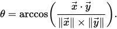

# CodeAndLink

## faire une clée unique avec deux unsigned int (ou uint32 = pareil)
https://stackoverflow.com/questions/6064566/concatenate-two-32bit-numbers-to-get-a-64bit-result
```c++
#include <stdint.h>

uint32_t a, b;
uint64_t c;

c = ((uint64_t)a << 32) | b;  
````
## angle entre deux vecteur
https://openclassrooms.com/forum/sujet/fonction-calcul-d-angle-entre-2-vecteurs-22322  
https://www.mvps.org/directx/articles/math/dot/index.htm  

  
arcos(produit scalaire / vector1.lenght*vector2.lenght) = angle en radian = (angle en radian * 180/3.14) degre  
